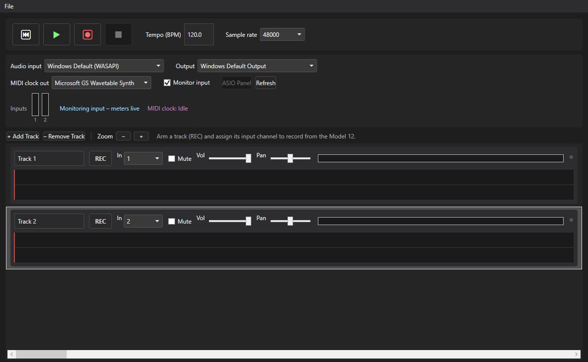

# SimpleDAW

SimpleDAW is a lightweight digital audio workstation built with WPF and .NET 8.

## Screenshot



## Features

- Multi-track playback and audio routing
- Live input support
- Waveform visualization
- MIDI timing/clock support

## Recording many tracks at once

Simultaneously arming and recording a large number of tracks (e.g. 24) requires
an ASIO-capable audio interface exposing that many physical inputs (selected
under Audio input). The Windows Default (WASAPI) fallback captures from a
single default input device, which is realistically stereo (2 channels), so it
can only feed 1-2 armed tracks at a time regardless of how many tracks exist
in the project.

## Build

```bash
dotnet restore SimpleDAW.csproj
dotnet build SimpleDAW.csproj -c Release
```

## Release Installer

This repository includes GitHub Actions workflow automation to build a Windows installer on version tags (`v*`).
